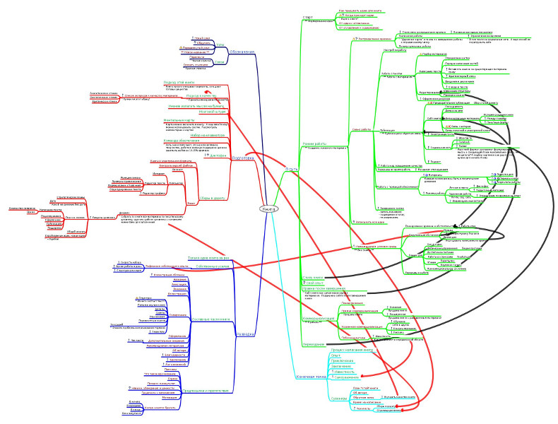

# Ментальные карты

У этого явления много названий: «мозговые карты», «ментальные карты»,
«логические диаграммы» и другие.  Смысл у них всех один и тот же:
наглядное представление структурированной информации с помощью текста
и линий связи.  В таких картах так же могут встречаться и рисунки.

[Рисунок: Пример ментальной карты]

Если карта не имеет центрального узла, то она представляет собой
*нейронную карту*.

[Рисунок: Пример нейронной карты]

Но больше всего мне нравятся просто хорошо оформленные страницы
(«скетчи»), содержащие много рисунков и текста, в некотором смысле они
похожи на инфографику, а еще их легко использовать в презентациях.

[Рисунок: Пример скетча]

В любом случае каким бы ни был внешний вид этих страниц, они служат
для наглядного представления идеи книги.  В общем случае книгу можно
представить как ментальную карту, где центральным объектом является
книга, узлами первого уровня являются разделы и далее главы и пункты.

Карта этой книги (завершено 60%)

Эта карта играет весьма важную роль в процессе написания книги,
поскольку позволяет наглядно представить структуру книги, и облегчает
ее понимание и оттачивание.  А если использовать компьютерные средства
для создания таких карт, то их можно легко отправлять, вносить в них
правки и работать совместно.  Работа с [командой поддержки]
значительно облегчается, когда структура книги наглядно представлена в
виде карты.

Для того, чтобы не запутаться в изменениях в структуре, особенно, если
они делаются в электронной версии карты, я рекомендую не переносить
элементы, а отмечать куда их нужно перенести с помощью стрелок, и
переносить их только после того, как это будет сделано в книге.  Новые
элементы я всегда отмечаю другим цветом, чтобы знать, что они еще не
представлены в оглавлении книги.

Карты пригодятся не только для структуры книги, но и для обдумывания
структуры сайта, для оформления любых других элементов не только
книги, которые имеют структуру.  А еще этот метод хорошо подходит для
чтения книг и для обучения.
